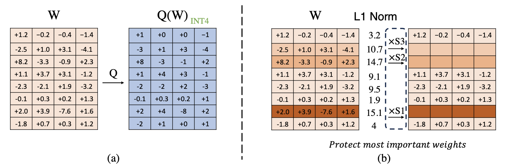

# LLM-IAQ: Importance-Aware Quantization for Large Language Models

## Introduction

<p align="center">

</p>

We introduce Importance-Aware Quantization (IAQ) for large language models (LLMs). IAQ is a to-be-further-develop quantization method that leverages the importance of each channel of weight to quantize the model.

## Install

1. Clone this repository and navigate to IAQ folder
```
git clone https://github.com/natsunoshion/llm-iaq
cd llm-iaq
```

2. Install Package
```
conda create -n iaq python=3.10 -y
conda activate iaq
pip install --upgrade pip  # enable PEP 660 support
pip install -e .
```

3. Install efficient W4A16 (4-bit weight, 16-bit activation) CUDA kernel and optimized FP16 kernels (e.g. layernorm, positional encodings).
```
cd iaq/kernels
python setup.py install
```

## Scripts

We provide some scripts to test our iaq method. In the folder of ./scripts, we provide (multimodal) large language models running code with our iaq to quantize.

For example:

```
cd scripts
bash llama3.2-1b.sh
```

to test our method.

## Acknowledgement

We thank the authors of [LLM.int8()](https://github.com/bitsandbytes-foundation/bitsandbytes), [AWQ](https://github.com/mit-han-lab/llm-awq) and [Smoothquant](https://github.com/mit-han-lab/smoothquant) for their great work.
